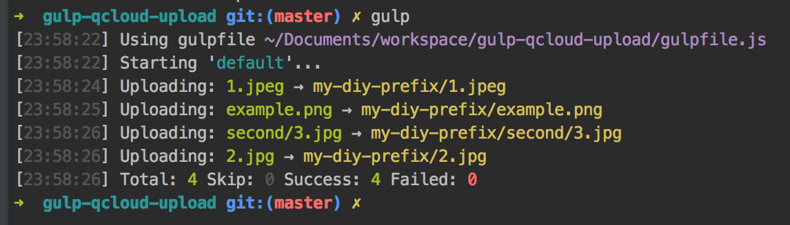

# gulp-qcloud-upload

[](https://www.npmjs.com/package/gulp-qcloud-upload)

> Qcloud COS upload plugin for Gulpjs. 腾讯云COS 上传插件.
> 
> 适合于腾讯云最新的[COSV4](https://console.qcloud.com/cos4)（云对象存储v4）版本，基于官方JSON API进行开发，可完美配合腾讯云CDN 使用。

## 安装

```bash
npm i gulp-qcloud-upload -S
```

## 配置

```javascript
var gulp = require('gulp');
var qcloudUpload = require('./index.js');

gulp.task('default', function () {
    return gulp.src('./test/**/*')
        .pipe(qcloudUpload({
            appid: 'youor appid',
            secretId: 'your secretId',
            secretKey: 'your secretKey',
            bucket: 'bucket-name',
            region: 'sh',
            prefix: 'my-diy-prefix',
            overWrite: false,
            headers: {
				'Cache-Control': 'max-age=5184000'
			  }
        }));
});
```
## 效果



## 选项

### appid, secretId, secretKey

以上前往 [https://console.qcloud.com/capi](https://console.qcloud.com/capi) 获取APPID 与密钥信息。必填。

### bucket

Bucket 名称。必填。

### region

Bucket 所属地区。国内目前有华南、华东、华北区可选，对应值为：`gz`,`sh`,`tj`。必填。

### prefix

自定义COS 中的文件前缀，输入的字符串不包括文件名部分。如本地文件为`demo.png`，设置`prefix: 'my-diy-prefix'`，上传到COS 后的路径则为`my-diy-prefix/demo.png`；设置`prefix: 'my-diy-prefix/second'`，上传到COS 后的路径则为`my-diy-prefix/seconde/demo.png` 。选填。[详情](https://www.qcloud.com/document/product/436/6237 )

### overWrite

若COS 中已经有同名文件，是否覆盖。非必填，默认`false`。

### headers

为文件自定义http header 相关属性。非必填，默认无。

## 链接

第三方Node.js SDK: [qos-node-client](https://github.com/Youmoo/qos-node-client)

腾讯云官方文档：[https://www.qcloud.com/document/product/436/8629](https://www.qcloud.com/document/product/436/8629)
